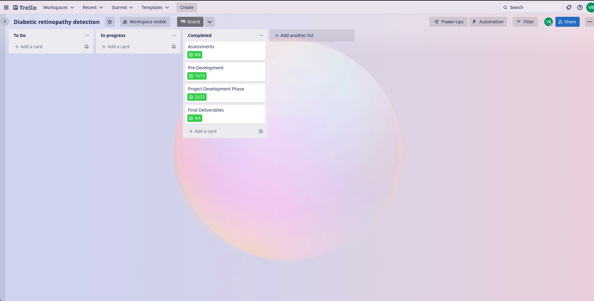

# Introduction
Diabetic Retinopathy (DR) is a common complication of diabetes mellitus, which causes lesions on the retina that affect vision. If it is not detected early, it can lead to blindness. Unfortunately, DR is not a reversible process, and treatment only sustains vision. DR early detection and treatment can significantly reduce the risk of vision loss. The manual diagnosis process of DR retina fundus images by ophthalmologists is time, effort and cost-consuming and prone to misdiagnosis unlike computer-aided diagnosis systems. 

Transfer learning has become one of the most common techniques that has achieved better performance in many areas, especially in medical image analysis and classification. We used Transfer Learning techniques like Inception V3,Resnet50,Xception V3 that are more widely used as a transfer learning method in medical image analysis and they are highly effective.

# Team members
- Balaji V [Assignment](https://github.com/IBM-EPBL/IBM-Project-13348-1659516930/tree/main/Assessments/Team%20Lead%20(Balaji%20V))
- Thapashvin R [Assignment](https://github.com/IBM-EPBL/IBM-Project-13348-1659516930/tree/main/Assessments/M1%20Lead%20(Thapashvin%20R))
- Sriram K [Assignment](https://github.com/IBM-EPBL/IBM-Project-13348-1659516930/tree/main/Assessments/M2%20Lead%20(Sriram%20K))
- Vignesh B [Assignment](https://github.com/IBM-EPBL/IBM-Project-13348-1659516930/tree/main/Assessments/M3%20Lead%20(Vignesh%20B))
- # IBM-Project-18407-1659684768

## TEAM ID : PNT2022TMID29261

# Project Title          :   Deep Learning Fundus Image Analysis for Early Detection of Diabetic Retinopathy

## Faculty Mentor(s) Name :   Dr.P . Arjun 

# Empathy map

# Project Tracking
