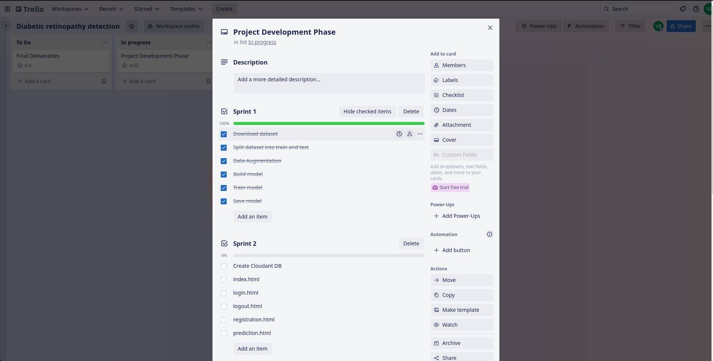

This model is trained using [kaggle dataset](https://www.kaggle.com/datasets/arbethi/diabetic-retinopathy-level-detection?select=preprocessed+dataset)

> Note:  
> - These all done using google colab.   
> - this is not the actual deployment using IBM Watson studio.
> - The actual IBM Watson studio model train and deployment jupyter notebook is placed in [Sprint 3](https://github.com/IBM-EPBL/IBM-Project-13348-1659516930/tree/main/Project%20Development%20Phase/Sprint%203)
